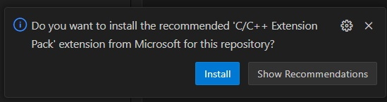
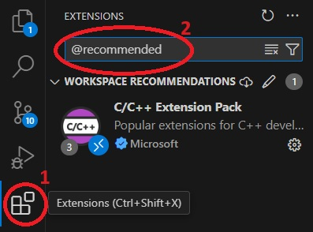
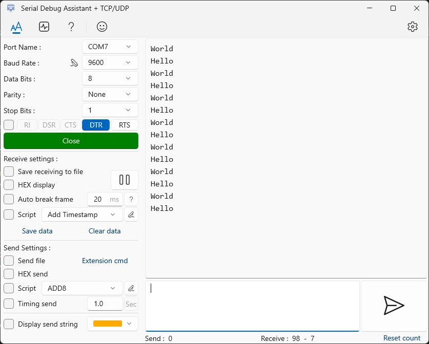

# pico-w-hello-world

A simple hello-world example project targeting the Raspberry Pi Pico and using VSCode IDE

## Setup

### Windows

Install [Visual Studio Code from the Microsoft Store](https://apps.microsoft.com/detail/xp9khm4bk9fz7q).

If running under Windows, install [WSL](https://docs.microsoft.com/en-us/windows/wsl/install) and your desired flavor of Linux. I recommend using Ubuntu 22.04 as that is what I have used for development. Then the steps under [Linux](#linux) may be run within your WSL instance.

### Linux

If running Linux natively or in a VM (not under Windows WSL), install [Visual Studio Code from the a linux repository](https://code.visualstudio.com/docs/setup/linux). Then execute the steps below.

1. Install git, cmake, and gcc-arm-none-eabi compiler by running the following commands
```bash
sudo apt update
sudo apt -y install git cmake gcc-arm-none-eabi
```

2. Clone the pico-sdk.
```bash
git clone https://github.com/raspberrypi/pico-sdk.git
```

3. Set PICO_SDK_PATH environment variable in bashrc file and apply it to current environment.
```bash
echo "export PICO_SDK_PATH=$(pwd)/pico-sdk" >> ~/.bashrc
export PICO_SDK_PATH=$(pwd)/pico-sdk
```

4. Initialize the pico-sdk submodules.
```bash
cd pico-sdk
git submodule update --recursive --init
cd ..
```

5. Clone this repo.
```bash
git clone https://github.com/Tails86/pico-w-hello-world.git

```

6. Open this project in Visual Studio Code.
```bash
cd pico-w-hello-world
code .
```

7. Within a few seconds after opening this project, a popup should show on the bottom right recommending to install "C/C++ Extension Pack". Click install to install this recommended package.



If you don't see this popup, click on the extensions icon on the left and manually search for "@recommended". Then install the package that shows up.



8. Restart Visual Studio Code after installing the extensions (refer back to step 6 on how to open the project).

9. After the extension is installed and Visual Studio Code is restarted, pressing `ctrl+shift+b` will activate the default cmake task to configure, build, and install the package. If everything works right, you will find the package under `dist/main.uf2`.

## Loading the UF2 Binary

Hold the BOOTSEL button on the Pico while plugging the USB connection into your PC. A drive with a FAT partition labeled RPI-RP2 should pop up on your system. Open this drive, and then copy the main.uf2 file here. The Pico should then automatically load the binary into flash and run it. For more information, refer to the official [Raspberry Pi Pico documentation](https://www.raspberrypi.com/documentation/microcontrollers/raspberry-pi-pico.html#documentation).

### Seeing the printf Output

Use a serial communication terminal such as the [Serial Debug Assistant on the Microsoft Store](https://apps.microsoft.com/detail/9nblggh43hdm).

Find a device under the Port Name which matches "USB Serial Device". Then make sure DTR is selected before opening the port. You should start to see "Hello" and "World" printed here.
